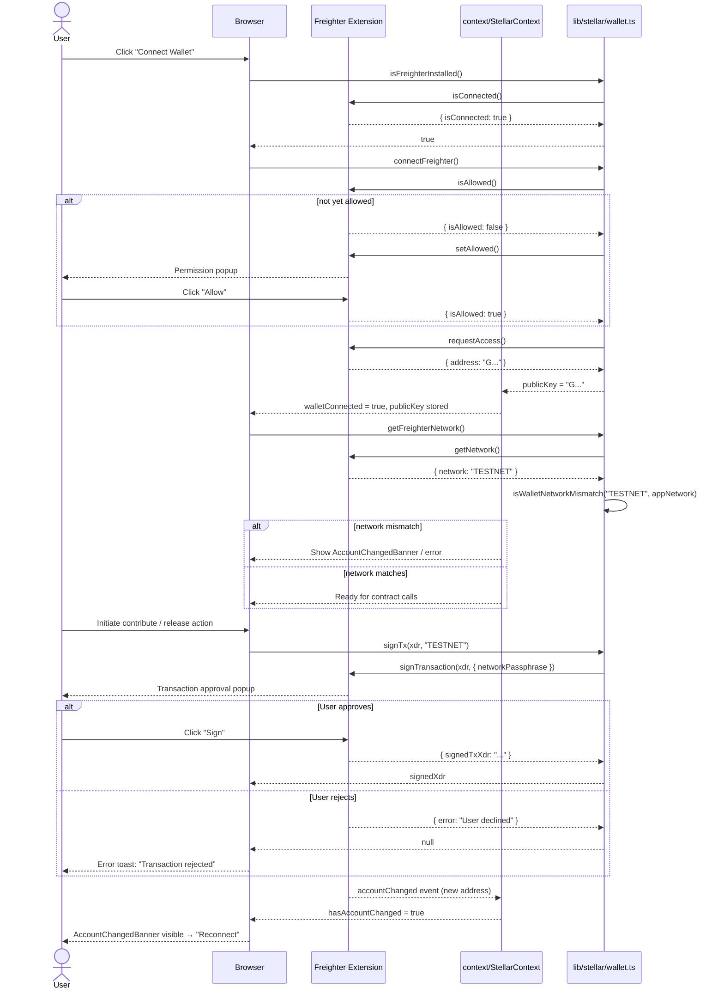
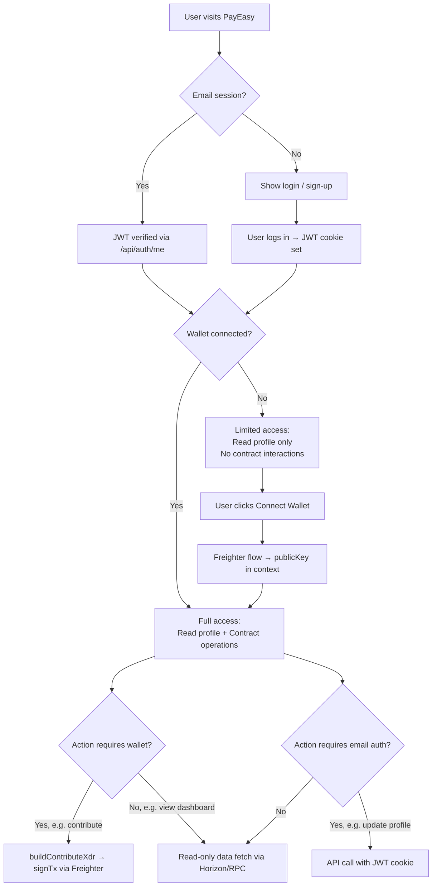

# Authentication Flow

PayEasy supports two independent authentication paths that can be active simultaneously for the same browser session: **Email / JWT** (traditional credential-based auth) and **Freighter Wallet** (Stellar public-key-based auth). This document describes each flow and explains how the two systems interact.

---

## 1. Email JWT Authentication Flow

Users register with an email and password. The server hashes the password, persists the account to `data/users.json`, and issues a signed JWT that is stored in an `HttpOnly` cookie.

```mermaid
sequenceDiagram
    actor User
    participant Browser
    participant NextAPI as Next.js API Routes
    participant AuthLib as lib/auth/users.ts
    participant JWTLib as lib/auth/jwt.ts

    %% Registration
    User->>Browser: Fill sign-up form (name, email, password)
    Browser->>NextAPI: POST /api/auth/signup
    NextAPI->>AuthLib: findUserByEmail(email)
    AuthLib-->>NextAPI: null (user not found)
    NextAPI->>AuthLib: createUser(name, email, hashedPassword)
    AuthLib-->>NextAPI: { userId, email, name }
    NextAPI->>JWTLib: signToken({ userId, email, name })
    JWTLib-->>NextAPI: signed JWT
    NextAPI-->>Browser: Set-Cookie: auth_token=<JWT>; HttpOnly; Secure
    Browser-->>User: Redirected to dashboard

    %% Login
    User->>Browser: Fill login form (email, password)
    Browser->>NextAPI: POST /api/auth/login
    NextAPI->>AuthLib: findUserByEmail(email)
    AuthLib-->>NextAPI: { userId, email, hashedPassword, ... }
    NextAPI->>NextAPI: bcrypt.compare(password, hashedPassword)
    NextAPI->>JWTLib: signToken({ userId, email, name })
    JWTLib-->>NextAPI: signed JWT
    NextAPI-->>Browser: Set-Cookie: auth_token=<JWT>; HttpOnly; Secure
    Browser-->>User: Redirected to dashboard

    %% Authenticated request
    Browser->>NextAPI: GET /api/auth/me (Cookie: auth_token)
    NextAPI->>JWTLib: verifyToken(token)
    JWTLib-->>NextAPI: AuthPayload | null
    alt token valid
        NextAPI-->>Browser: 200 { userId, email, name }
    else token invalid / expired
        NextAPI-->>Browser: 401 Unauthorized
        Browser-->>User: Redirect to /login
    end

    %% Token refresh
    Browser->>NextAPI: POST /api/auth/refresh (Cookie: auth_token)
    NextAPI->>JWTLib: isTokenExpiringWithin(token, 86400)
    alt token expiring within 24 h
        NextAPI->>JWTLib: signToken(payload)
        JWTLib-->>NextAPI: new JWT
        NextAPI-->>Browser: Set-Cookie: auth_token=<new JWT>
    else token still valid
        NextAPI-->>Browser: 200 (no new cookie)
    end

    %% Logout
    User->>Browser: Click "Log out"
    Browser->>NextAPI: POST /api/auth/logout
    NextAPI-->>Browser: Set-Cookie: auth_token=; Max-Age=0
    Browser-->>User: Redirect to /login
```

**Key points:**

- Passwords are hashed with `bcrypt` before storage — the plain-text password never persists.
- The JWT is signed with `AUTH_SECRET` using HS256 and expires after `JWT_EXPIRY` (default `7d`).
- All auth cookies are `HttpOnly` and `Secure`, preventing JavaScript access.
- Token refresh is proactive: the client calls `/api/auth/refresh` within 24 hours of expiry to get a new token without requiring re-login.

---

## 2. Freighter Wallet Authentication Flow

Users connect their Stellar wallet via the Freighter browser extension. No password is involved — identity is proved by the wallet's ability to sign transactions. The wallet public key is stored alongside the JWT session for contract operations.



**Key points:**

- The wallet public key is held in React context (`StellarContext`) only — it is never persisted to `data/users.json` automatically.
- Network validation runs on connect and on every transaction to prevent signing on the wrong chain.
- Account-change detection triggers a banner that prompts the user to reconnect, avoiding silent identity switches.

---

## 3. Session Merging — Both Systems Together

A user can be authenticated via email **and** have a Freighter wallet connected simultaneously. The two sessions are independent but complement each other.



**Session merging rules:**

| Capability | Email JWT only | Freighter only | Both |
|---|---|---|---|
| View dashboard | ✅ | ❌ (no profile) | ✅ |
| Update profile / password | ✅ | ❌ | ✅ |
| Create escrow contract | ❌ | ✅ | ✅ |
| Sign / submit transaction | ❌ | ✅ | ✅ |
| View contract state | ✅ (read-only RPC) | ✅ | ✅ |
| Export account data | ✅ | ❌ | ✅ |

The email session and wallet session share the same browser tab but are stored separately: the JWT lives in an `HttpOnly` cookie; the wallet public key lives in React context (`StellarContext`) and is re-requested from Freighter on page reload.